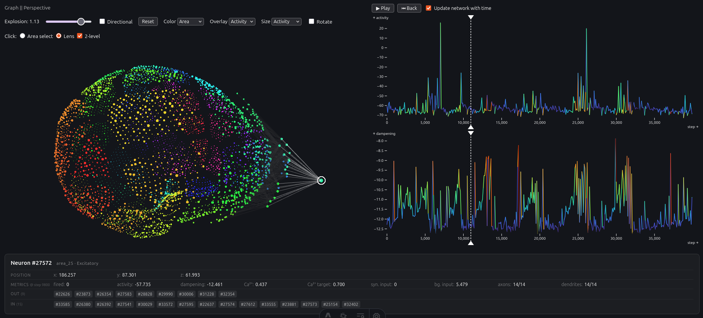

# Neuronal Lens



You can find the full paper [here](https://doi.org/10.2312/vcbm.20261012).

To start, run `bun install` and then

```bash
bun dev
```

# Citation

If you find Neuronal Lens useful or relevant to your work, please feel free to cite it as follows:

```bibtex
@inproceedings{2026-neuronal-lens,
	booktitle = {VCBM 2026 - Eurographics Workshop on Visual Computing for Biology and Medicine - Short Papers},
	editor    = {Krueger, Robert and Mörth, Eric and Furmanová, Katarina},
	title     = {{Interactive 3D Exploration of Large-Scale Neuronal Network Simulations with a Graph Lens}},
	author    = {Waldert, Peter and Kantz, Benedikt and Tussardi, Gaia and Lengauer, Stefan and Schreck, Tobias},
	year      = {2026},
	publisher = {The Eurographics Association},
	issn      = {2070-5786},
	isbn      = {978-3-03868-324-7},
	doi       = {10.2312/vcbm.20261012}
}
```
